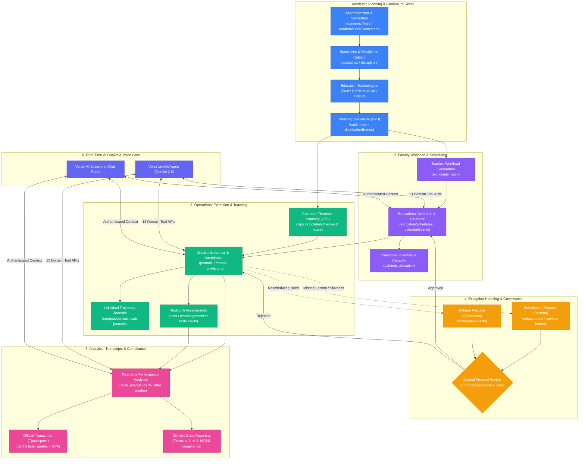
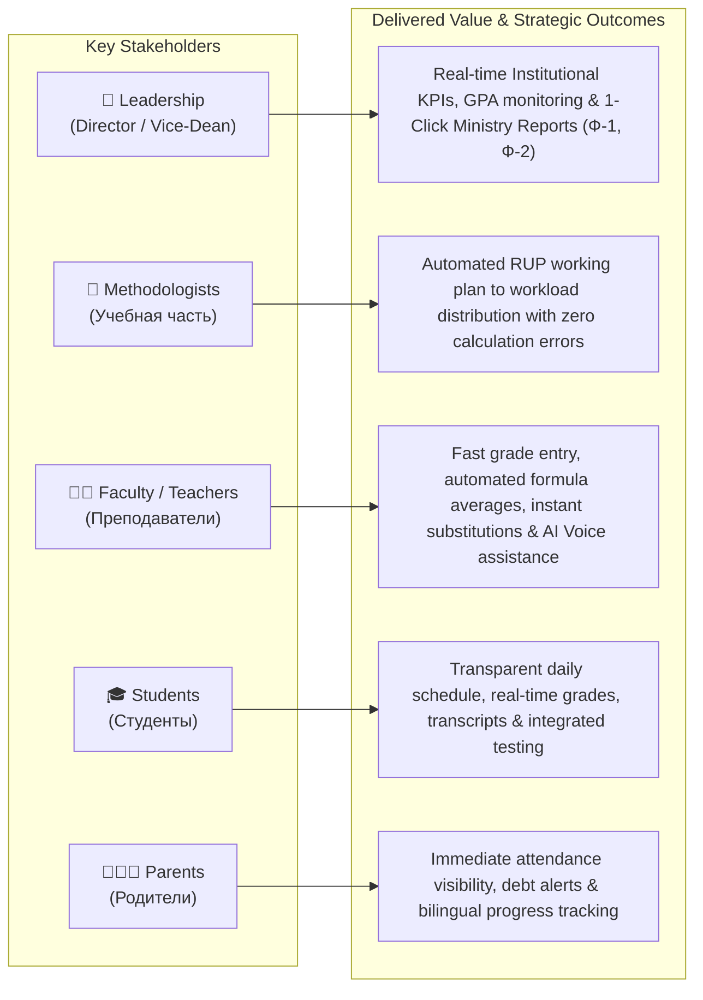

# 🗺️ MARS 2.0 — Strategic Product Business Roadmap & Flow

> **MARS 2.0 (Минимальная Автоматизация Расписания Специальностей)**  
> Next-Generation Education Management & AI-Powered Operations Platform for Technical & Vocational Education (TVET / ТиПО) and Higher Education.

---

## 📑 Table of Contents
1. [Core Business Process Flow](#1-core-business-process-flow)
2. [Strategic Product Horizons & Roadmap (Gantt)](#2-strategic-product-horizons--roadmap-gantt)
3. [Multi-Layer System & AI Architecture](#3-multi-layer-system--ai-architecture)
4. [Persona Value Stream & User Journeys](#4-persona-value-stream--user-journeys)
5. [Domain Capability Breakdown](#5-domain-capability-breakdown)
6. [Key Objectives & Strategic OKRs](#6-key-objectives--strategic-okrs)

---

## 1. Core Business Process Flow

The following flow illustrates how pedagogical data originates from institutional standards down to student grading, administrative approval gates, and state compliance reporting:



---

## 2. Strategic Product Horizons & Roadmap (Gantt)

```mermaid
gantt
    title MARS 2.0 Strategic Product Roadmap (2026 - 2028)
    dateFormat  YYYY-MM-DD
    axisFormat  %Y-Q%q

    section Phase 1: Core Foundation
    Convex Reactive DB Migration (Deprecate tRPC)     :done, p1_1, 2026-01-01, 2026-04-15
    Tri-lingual Localization (Paraglide RU/KK/EN)     :done, p1_2, 2026-02-15, 2026-05-01
    Dynamic Time-Bounded RBAC System                 :done, p1_3, 2026-03-01, 2026-05-28
    LiveKit Realtime Voice + AI Chat Copilot (13 tools) :done, p1_4, 2026-03-10, 2026-06-15
    Protocol Admin Approval Gate (Substitutions/Makeups) :done, p1_5, 2026-05-15, 2026-06-20
    Individual Journals & Budget Subsystem           :done, p1_6, 2026-06-01, 2026-07-15

    section Phase 2: Workload & Hardening (Q3 2026)
    Bundle Optimization & Lazy-Loading (Apex/AI)      :done, p2_1, 2026-08-01, 2026-08-16
    0ms Instant Role-Fallback Permissions & Cache     :done, p2_2, 2026-08-10, 2026-08-17
    Workload Migration: Flat Weeks -> Semester Array  :active, p2_3, 2026-08-15, 2026-09-30
    Planned Hours Canonical Reconciliation (totalHours) :active, p2_4, 2026-08-20, 2026-09-25
    High-Performance ExcelJS Journal Engine           :active, p2_5, 2026-09-01, 2026-09-30

    section Phase 3: Intelligence & Logistics (Q4 2026)
    Full Offline-First PWA Synchronization            :crit, p3_1, 2026-10-01, 2026-11-15
    Automated Timetable Clash & Room Conflict Engine  :p3_2, 2026-10-15, 2026-11-30
    Student Academic Debt & Retake Management Portal  :p3_3, 2026-11-01, 2026-12-15
    WebPush & Telegram Notification Bot Hub           :p3_4, 2026-11-15, 2026-12-31
    Ministry of Education (НОБД / МОН РК) XML/JSON API:p3_5, 2026-12-01, 2026-12-31

    section Phase 4: Enterprise & Ecosystem (2027)
    AI Automated Constraint-Satisfaction Timetable Gen :p4_1, 2027-01-05, 2027-04-30
    Capacitor Native iOS & Android App Store Release  :p4_2, 2027-02-01, 2027-05-31
    Multi-College Enterprise Tenancy Architecture     :p4_3, 2027-04-01, 2027-08-31
    SSO with eGov.kz / Digital ID / Kundelik / Bilim  :p4_4, 2027-06-01, 2027-09-30
    LMS Course Materials & Video Lecture Repository   :p4_5, 2027-08-01, 2027-11-30

    section Phase 5: Predictive AI & National Scale (2028+)
    Predictive Drop-out & Academic Debt Early-Warning :p5_1, 2028-01-05, 2028-06-30
    Autonomous Multilingual Voice Tutor for Students  :p5_2, 2028-03-01, 2028-09-30
    WorldSkills Kazakhstan National Competency Matrix :p5_3, 2028-06-01, 2028-12-31
```

---

## 3. Multi-Layer System & AI Architecture

```mermaid
graph TB
    subgraph UI_Layer["1. Presentation & Mobile-First Client Layer"]
        F7["Framework7 9 (iOS/Material)"]
        VUE["Vue 3 Composition API"]
        TW["Tailwind CSS + Scoped Themes"]
        PARA["Paraglide JS (RU, KK, EN)"]
        CHARTS["ApexCharts (Lazy-Loaded)"]
    end

    subgraph Client_State["2. State, Caching & Offline PWA Layer"]
        PINIA["Pinia Reactive Stores"]
        LOCAL["localForage (IndexedDB Cache)"]
        SW["Service Worker (Workbox Auto-Update)"]
        RBAC_C["0ms Role-Fallback RBAC Cache"]
        OFF_Q["Client Offline Queue Engine"]
    end

    subgraph Sync_Transport["3. Real-Time Transport & Edge Gateway"]
        WS["Convex WebSocket Realtime Subscriptions (convex-vue)"]
        HTTP["Convex HTTP Actions (/api/*)"]
        RTC["LiveKit WebRTC Audio Stream (48kHz Opus)"]
    end

    subgraph AI_Core["4. AI & Autonomous Agent Core"]
        LK_AGENT["Standalone LiveKit Agent (agent/agent.ts)"]
        GEMINI["Google Gemini 2.5 Flash Native Audio"]
        V_SDK["Vercel AI SDK (@ai-sdk/vue + Streaming)"]
        TOOLS["13 Domain Tool Handlers (Schedule, Marks, RUP, Students)"]
    end

    subgraph Backend_DB["5. Convex Serverless Backend (Rust Core)"]
        SCHEMAS["Schema Definitions (10 Domain Modules)"]
        MIGRATIONS["@convex-dev/migrations (Expand-Contract Engine)"]
        RBAC_B["Dynamic Role & Time-Bounded Security Engine"]
        MUT_QUERIES["Queries & Mutations (ACID Optimistic Concurrency)"]
    end

    subgraph External_Integrations["6. External Services & Cloudflare Edge"]
        CF_PAGES["Cloudflare Pages Edge CDN (iam-mars.kz)"]
        LK_CLOUD["LiveKit Cloud Cluster"]
        TG_BOT["Telegram Notification Bot"]
        EXCEL["ExcelJS Engine (Server & Client Zip Stream)"]
    end

    UI_Layer --> Client_State
    Client_State --> Sync_Transport
    Sync_Transport --> Backend_DB
    Sync_Transport --> AI_Core
    AI_Core --> Backend_DB
    Backend_DB --> External_Integrations
```



---

## 4. Persona Value Stream & User Journeys



---

## 5. Domain Capability Breakdown

| # | Business Domain | Core Capabilities | Current Status | Key Target Metric |
|---|---|---|---|---|
| **1** | **Academic Planning (РУП & КТП)** | Modular disciplines, learning outcomes, credit distribution, multilingual RUP variants (`ru`, `kk`, `en`), KTP-to-RUP synchronization. | **Production-Ready** | 100% curriculum compliance, 0-second budget reconciliation. |
| **2** | **Teacher Workload** | Automated faculty load matrix from RUP, 6-semester distribution, hourly conversion by education technology, Excel export. | **In Migration** | Elimination of manual load spreadsheets, automated over-hours alert. |
| **3** | **Electronic Journal** | Daily gradebook, periodic checkpoints (РК-1, РК-2), formula weighted grading, individual sub-journals, audit history. | **Production-Ready** | Sub-50ms mark entry response, 100% cell mutation auditability. |
| **4** | **Timetable & Logistics** | Weekly slot grids, multi-step scheduling wizard, substitutions (Замены), makeup hours (Отработки), central protocol gate. | **Production-Ready** | 0 timetable collisions, complete audit trail for all schedule exceptions. |
| **5** | **Student & Faculty SIS** | Student lifecycle, 9-year vs 11-year base tracking, course transfer orders (№ Приказа), teacher directory, password reset audit. | **Production-Ready** | Instant full-text search across 5,000+ student profiles. |
| **6** | **Assessment & Testing** | Question bank management, test assignments directly to journals, automatic scoring, time limit enforcement. | **Implemented** | Automated grading sync with electronic journal records. |
| **7** | **Analytics & Reporting** | Cohort KPIs, GPA computation, ECTS transcripts, Ministry Form 1 (monthly) and Form 2 (annual faculty report). | **Production-Ready** | 1-click generation of national compliance filings. |
| **8** | **AI Voice & Chat Copilot** | Gemini 2.5 Flash Native Audio WebRTC assistant + Vercel AI SDK chat with 13 authenticated domain tools. | **Production-Ready** | <800ms voice query latency for schedule and mark lookups. |
| **9** | **Security & Dynamic RBAC** | Action-level (`navigate`, `read`, `write`) permissions, time-bounded access, 0ms role-fallback, immutable audit log. | **Production-Ready** | Zero unauthorized access incidents, continuous audit compliance. |

---

## 6. Key Objectives & Strategic OKRs

```mermaid
mindmap
  root((MARS 2.0 OKRs))
    O1: Academic Excellence
      KR1: 100% automated validation of RUP and KTP hours
      KR2: Zero calculation discrepancies between planned and executed workload
      KR3: Instant generation of Ministry Forms Ф-1 & Ф-2
    O2: Operational Velocity
      KR1: Sub-1 second grade entry and real-time synchronization
      KR2: 90% reduction in schedule substitution processing time via Protocol Gate
      KR3: Full offline PWA support for uninterrupted classroom gradebook entry
    O3: AI-First User Experience
      KR1: Sub-800ms response time for Gemini 2.5 LiveKit Voice queries
      KR2: 13 domain tools supporting autonomous teacher and student task resolution
      KR3: Tri-lingual parity (Kazakh, Russian, English) across 100% of workflows
    O4: Enterprise Security & Scale
      KR1: Dynamic RBAC with sub-1ms client-side permission evaluation
      KR2: Zero-downtime database migrations via @convex-dev/migrations
      KR3: Multi-institution tenancy ready for national college rollouts
```

---

*Document version: 2.0.0 | Last updated: August 17, 2026 | Architecture: Convex + Vue 3 + LiveKit AI*
