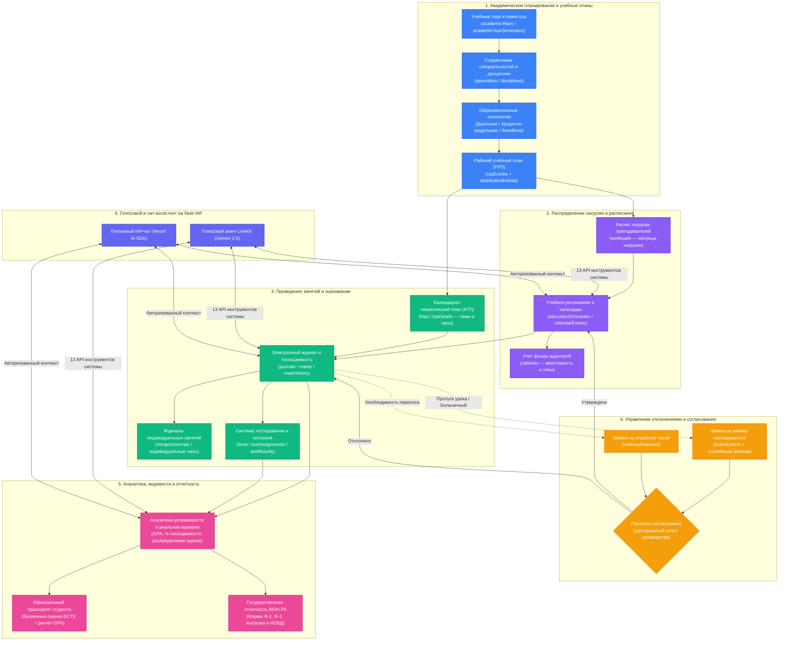
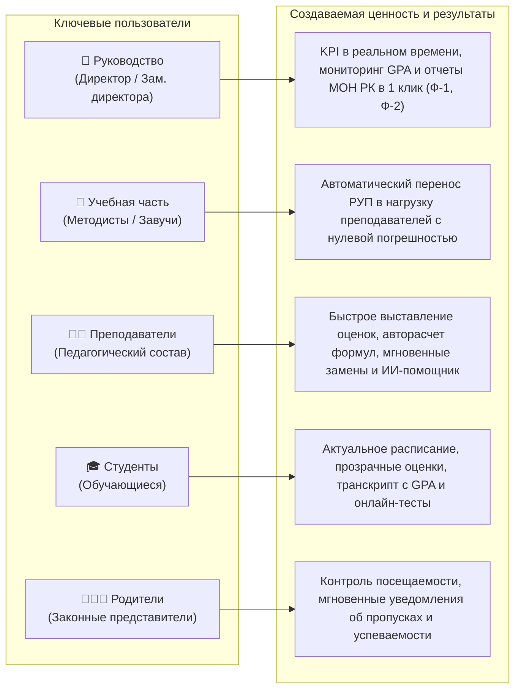
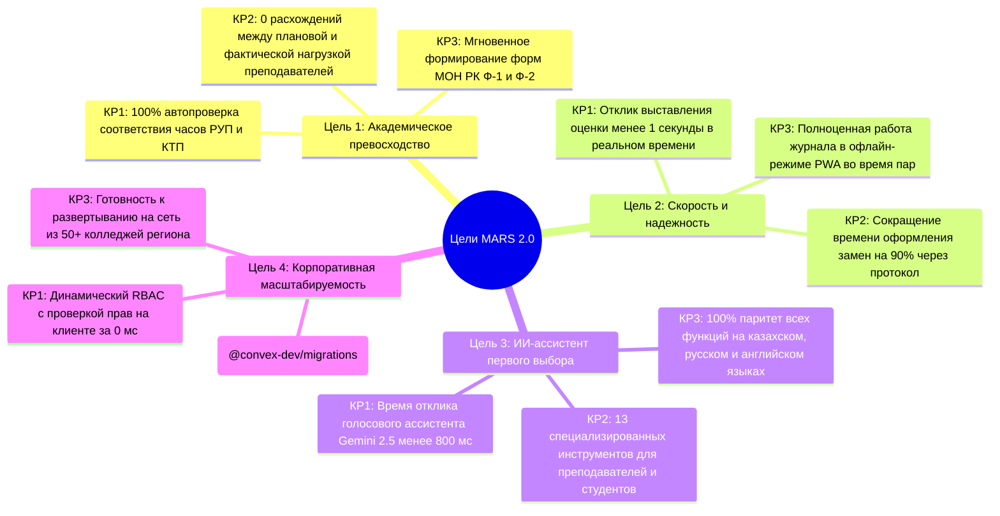

# 🗺️ MARS 2.0 — Стратегическая дорожная карта и бизнес-процессы продукта

> **MARS 2.0 (Минимальная Автоматизация Расписания Специальностей)**  
> Интеллектуальная система управления образовательным процессом и расписанием для колледжей (ТиПО) и вузов Республики Казахстан.

---

## 📑 Содержание
1. [Сквозной бизнес-процесс системы](#1-сквозной-бизнес-процесс-системы)
2. [Стратегические горизонты и дорожная карта (Gantt)](#2-стратегические-горизонты-и-дорожная-карта-gantt)
3. [Многоуровневая архитектура системы и ИИ](#3-многоуровневая-архитектура-системы-и-ии)
4. [Потоки ценности по ролям пользователей](#4-потоки-ценности-по-ролям-пользователей)
5. [Функциональная матрица модулей](#5-функциональная-матрица-модулей)
6. [Ключевые цели и результаты (OKRs)](#6-ключевые-цели-и-результаты-okrs)

---

## 1. Сквозной бизнес-процесс системы

Диаграмма иллюстрирует полный жизненный цикл данных: от стандартов ГОСО и формирования РУП до ежедневного оценивания в журналах, согласования замен через протокол и формирования государственной отчетности:



---

## 2. Стратегические горизонты и дорожная карта (Gantt)

```mermaid
gantt
    title Стратегическая дорожная карта MARS 2.0 (2026 - 2028)
    dateFormat  YYYY-MM-DD
    axisFormat  %Y-Кв%q

    section Этап 1: Базовый фундамент
    Миграция на реактивный Convex DB (вывод tRPC)     :done, p1_1, 2026-01-01, 2026-04-15
    Трехъязычная локализация Paraglide (RU/KK/EN)     :done, p1_2, 2026-02-15, 2026-05-01
    Динамическая система ролей и прав RBAC            :done, p1_3, 2026-03-01, 2026-05-28
    Голосовой ИИ LiveKit + Чат-ассистент (13 тулов)   :done, p1_4, 2026-03-10, 2026-06-15
    Шлюз утверждения замен и отработок (Протокол)     :done, p1_5, 2026-05-15, 2026-06-20
    Подсистема индивидуальных журналов и бюджета      :done, p1_6, 2026-06-01, 2026-07-15

    section Этап 2: Нагрузка и оптимизация (Q3 2026)
    Оптимизация бандла и ленивая загрузка (Apex/AI)   :done, p2_1, 2026-08-01, 2026-08-16
    Мгновенный 0ms рендеринг меню и кэш прав RBAC     :done, p2_2, 2026-08-10, 2026-08-17
    Миграция нагрузки: плоские недели -> массив семестров :active, p2_3, 2026-08-15, 2026-09-30
    Сверка канонических плановых часов (totalHours)   :active, p2_4, 2026-08-20, 2026-09-25
    Высокопроизводительный экспорт в Excel (ExcelJS)  :active, p2_5, 2026-09-01, 2026-09-30

    section Этап 3: Интеллект и логистика (Q4 2026)
    Офлайн-режим PWA с синхронизацией очередей        :crit, p3_1, 2026-10-01, 2026-11-15
    Автоматический детектор конфликтов аудиторий и пар :p3_2, 2026-10-15, 2026-11-30
    Портал академических задолженностей и пересдач    :p3_3, 2026-11-01, 2026-12-15
    Центр уведомлений: WebPush и Telegram-бот         :p3_4, 2026-11-15, 2026-12-31
    Интеграция с базой НОБД / МОН РК (XML/JSON API)   :p3_5, 2026-12-01, 2026-12-31

    section Этап 4: Экосистема и масштабирование (2027)
    ИИ-генератор расписания на основе ограничений     :p4_1, 2027-01-05, 2027-04-30
    Мобильные приложения в App Store и Google Play    :p4_2, 2027-02-01, 2027-05-31
    Мультитенантная архитектура для сети колледжей    :p4_3, 2027-04-01, 2027-08-31
    Единая авторизация (SSO) с eGov.kz / Kundelik/Bilim :p4_4, 2027-06-01, 2027-09-30
    Репозиторий учебных материалов и видеолекций КТП  :p4_5, 2027-08-01, 2027-11-30

    section Этап 5: Предиктивный ИИ и нац. масштаб (2028+)
    Предиктивная система раннего предупреждения отчислений :p5_1, 2028-01-05, 2028-06-30
    Автономный многоязычный ИИ-репетитор для студентов :p5_2, 2028-03-01, 2028-09-30
    Национальная матрица компетенций WorldSkills KZ   :p5_3, 2028-06-01, 2028-12-31
```

---

## 3. Многоуровневая архитектура системы и ИИ

```mermaid
graph TB
    subgraph UI_Layer["1. Клиентский интерфейс (Mobile-First UI)"]
        F7["Framework7 9 (Компоненты iOS/Material)"]
        VUE["Vue 3 Composition API"]
        TW["Tailwind CSS + Темы оформления"]
        PARA["Paraglide JS (RU, KK, EN)"]
        CHARTS["ApexCharts (Ленивая загрузка)"]
    end

    subgraph Client_State["2. Управление состоянием и офлайн-кэш"]
        PINIA["Реактивные хранилища Pinia"]
        LOCAL["localForage (Кэш в IndexedDB)"]
        SW["Service Worker (PWA автообновление)"]
        RBAC_C["0ms Кэш прав доступа RBAC"]
        OFF_Q["Клиентская очередь синхронизации"]
    end

    subgraph Sync_Transport["3. Транспорт реального времени"]
        WS["Convex WebSocket-подписки (convex-vue)"]
        HTTP["Convex HTTP Actions (/api/*)"]
        RTC["LiveKit WebRTC аудиопоток (48кГц Opus)"]
    end

    subgraph AI_Core["4. Ядро искусственного интеллекта"]
        LK_AGENT["Автономный агент LiveKit (agent/agent.ts)"]
        GEMINI["Google Gemini 2.5 Flash Native Audio"]
        V_SDK["Vercel AI SDK (@ai-sdk/vue + Streaming)"]
        TOOLS["13 доменных инструментов (Расписание, Оценки, РУП)"]
    end

    subgraph Backend_DB["5. Серверная БД Convex (Rust Core)"]
        SCHEMAS["Схемы данных (10 доменных модулей)"]
        MIGRATIONS["@convex-dev/migrations (Бесшовные миграции)"]
        RBAC_B["Серверный движок контроля доступа"]
        MUT_QUERIES["Мутации и запросы (ACID транзакции)"]
    end

    subgraph External_Integrations["6. Внешние сервисы и CDN Cloudflare"]
        CF_PAGES["Cloudflare Pages Edge CDN (iam-mars.kz)"]
        LK_CLOUD["Облачный кластер LiveKit"]
        TG_BOT["Telegram-бот оповещений"]
        EXCEL["Движок ExcelJS (Потоковая выгрузка архивов)"]
    end

    UI_Layer --> Client_State
    Client_State --> Sync_Transport
    Sync_Transport --> Backend_DB
    Sync_Transport --> AI_Core
    AI_Core --> Backend_DB
    Backend_DB --> External_Integrations
```



---

## 4. Потоки ценности по ролям пользователей



---

## 5. Функциональная матрица модулей

| # | Доменная область | Основные возможности | Текущий статус | Ключевой показатель (KPI) |
|---|---|---|---|---|
| **1** | **Академическое планирование (РУП и КТП)** | Модульные дисциплины, результаты обучения (РО), распределение кредитов, мультиязычные РУП (`ru`, `kk`, `en`), привязка тем КТП к часам РУП. | **Готово к эксплуатации** | 100% соответствие ГОСО, 0 секунд на сверку баланса часов. |
| **2** | **Нагрузка преподавателей** | Автогенерация матрицы нагрузки из РУП, раскладка по 6 семестрам, конвертация в астрономические часы, экспорт в Excel. | **В процессе миграции** | Полный отказ от ручных Excel-таблиц, автопредупреждения о перегрузке. |
| **3** | **Электронный журнал** | Ежедневный журнал, рубежные контроли (РК-1, РК-2), формульный расчет итогов, индивидуальные траектории, аудит изменений ячеек. | **Готово к эксплуатации** | Отклик ввода оценки <50 мс, 100% логирование правок оценок. |
| **4** | **Расписание и логистика** | Сетка пар и звонков, мастер создания занятий, модуль временных замен (Замены), отработка пропущенных часов, центральный протокол. | **Готово к эксплуатации** | 0 накладок в расписании, полный аудит всех служебных записок. |
| **5** | **Контингент студентов и кадры** | База 9/11 классов, статусы движения, приказы о переводе на следующий курс (№ Приказа), карточки преподавателей, история паролей. | **Готово к эксплуатации** | Мгновенный полнотекстовый поиск по 5000+ студентам. |
| **6** | **Тестирование и контроль знаний** | Банк тестовых заданий, привязка тестов к журналам, автопроверка результатов, таймер ограничения времени. | **Внедрено** | Автоматический перенос баллов за тесты в электронный журнал. |
| **7** | **Аналитика и отчетность** | Сводные KPI колледжа, расчет GPA, транскрипты ECTS, государственные отчеты: Форма Ф-1 (ежемесячная) и Форма Ф-2 (годовая). | **Готово к эксплуатации** | Формирование государственной отчетности в 1 клик. |
| **8** | **ИИ-ассистент (Голос и Чат)** | WebRTC голосовой агент Gemini 2.5 Native Audio + чат-панель с 13 инструментами поиска расписания, оценок и тем КТП. | **Готово к эксплуатации** | Задержка голосового ответа <800 мс при запросе расписания. |
| **9** | **Безопасность и RBAC** | Действия (`navigate`, `read`, `write`), временные окна доступа, 0ms ролевой fallback, неизменяемый журнал аудита прав. | **Готово к эксплуатации** | 0 инцидентов несанкционированного доступа, соответствие требованиям ИБ. |

---

## 6. Ключевые цели и результаты (OKRs)



---

*Версия документа: 2.0.0 | Дата обновления: 17 августа 2026 | Стек: Convex + Vue 3 + Framework7 + LiveKit AI*
